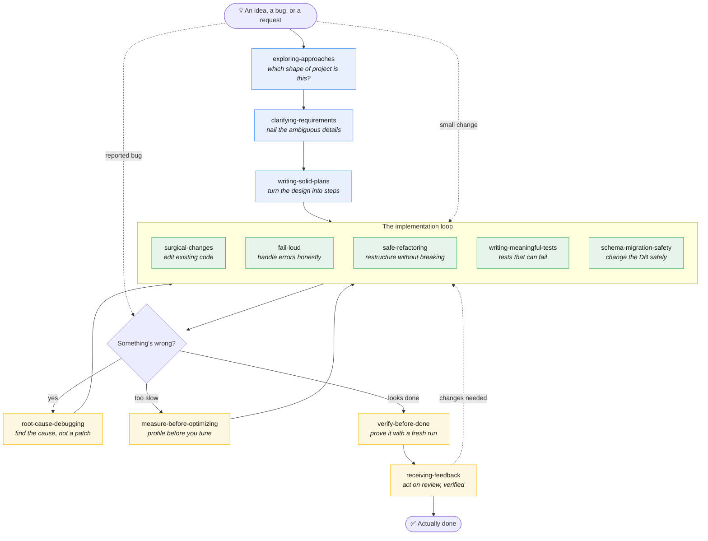

# no-cape

> "No capes!" — Edna Mode

Lean engineering-discipline skills for frontier-class AI models (Claude Fable 5, Opus 4.x, and beyond).

Heavyweight skill frameworks were written for an earlier generation of models — ones that needed Iron Laws repeated five times, rationalization tables, and "you MUST invoke this even at 1% relevance" to stay disciplined. Frontier models don't need the coercion. But buried inside that scaffolding is real knowledge: decision rules, stop conditions, and evidence requirements that no amount of model intelligence replaces.

**no-cape keeps the knowledge and drops the cape.**

## The skills

| Skill | Fires when | The kernel |
|-------|-----------|------------|
| [`exploring-approaches`](skills/exploring-approaches/SKILL.md) | Starting a project from a vague idea | A goal names a destination, not a route. Surface the distinct project shapes before refining any one — *even when the user has a preferred approach*. A three-condition brake keeps it from inventing options to look thorough. |
| [`clarifying-requirements`](skills/clarifying-requirements/SKILL.md) | Underspecified new work | Ask only questions whose answers change the design — one at a time, multiple choice preferred. Decompose bundled scope first. Short design before code. |
| [`writing-solid-plans`](skills/writing-solid-plans/SKILL.md) | Planning a multi-step feature or refactor | Plans are for readers with zero context: exact paths, real code, no placeholders ("TBD", "add appropriate error handling"). Self-review coverage and naming consistency before handoff. |
| [`surgical-changes`](skills/surgical-changes/SKILL.md) | Editing existing code | The diff is the product: every line traces back to the request. No drive-by cleanups — report improvements, don't apply them. |
| [`fail-loud`](skills/fail-loud/SKILL.md) | Writing error handling | A swallowed error is a bug with a delay timer. Every fallback is a product decision: "is the system actually correct when this branch executes?" |
| [`safe-refactoring`](skills/safe-refactoring/SKILL.md) | Restructuring working code | Never mix restructure with behavior change. Green before, between, after. Grep beyond the compiler before renaming. |
| [`writing-meaningful-tests`](skills/writing-meaningful-tests/SKILL.md) | Writing or modifying tests | Test behavior, not mocks. No test-only methods in production. Wait for conditions, never sleep. A test you've never seen fail proves nothing. |
| [`measure-before-optimizing`](skills/measure-before-optimizing/SKILL.md) | Performance work | No optimization without a measurement. State the baseline, fix the structural cost, re-measure the same workload. |
| [`schema-migration-safety`](skills/schema-migration-safety/SKILL.md) | Database schema changes | Old code runs against new schema during every deploy. Expand–contract, tested rollbacks, no data backfill inside migrations. |
| [`verify-before-done`](skills/verify-before-done/SKILL.md) | About to claim "done", "fixed", or "passing" | A claim needs a fresh command run in this turn. Lint ≠ build ≠ tests. Subagent "success" reports need a diff check. Tests passing ≠ requirements met. |
| [`receiving-feedback`](skills/receiving-feedback/SKILL.md) | Receiving review comments or corrections | Verify feedback against the codebase before implementing. Clarify every unclear item before acting on any. No performative agreement — the diff is the acknowledgment. |

Each skill is under 400 words. They state rules once and trust the model to follow them.

## The harness

The skills aren't a pipeline you march through — they're discipline that fires at the moment it's needed. This map shows *where in a project's life* each one waits for you. Most projects touch only a few; a one-line bug fix jumps straight to the debugging loop, while a greenfield service starts at the top.



### Where each skill helps you

**Front of the project — before any code (blue).**
- **`exploring-approaches`** stops you from building the wrong thing fast. When you say "a service that translates English audio," it surfaces the real fork (cloud API vs. self-host vs. SaaS) *before* anyone refines details — and challenges your stated preference if it spots a blind spot like data-residency rules.
- **`clarifying-requirements`** kicks in once the route is chosen but the details are fuzzy. It asks only the questions whose answers change the design, one at a time — no five-question dumps.
- **`writing-solid-plans`** helps when the work spans many steps. It forces a plan a context-less engineer could execute: exact paths, real code, zero "TBD".

**The implementation loop — while writing code (green).**
- **`surgical-changes`** keeps your diff honest in code you didn't just write — every line traces to the request, no drive-by cleanups.
- **`fail-loud`** helps the moment you write a `try/catch` or a fallback, so a swallowed error doesn't become a silent bug with a delay timer.
- **`safe-refactoring`** protects you when you restructure working code — never mixing a rename with a behavior change, staying green throughout.
- **`writing-meaningful-tests`** helps you write tests that actually prove something — testing behavior, not mocks, and never a test you haven't seen fail.
- **`schema-migration-safety`** is your guardrail on database changes, where old code runs against the new schema mid-deploy and a bad migration loses real data.

**Checking the work — before you claim it's done (yellow).**
- **`root-cause-debugging`** helps when something breaks: it stops the guess-and-patch spiral and, after three failed fixes, makes you question the architecture instead of the line.
- **`measure-before-optimizing`** helps when something's slow — it refuses to let you tune without a baseline measurement of the real workload.
- **`verify-before-done`** is the gate before you say "fixed" or "passing" — it demands a fresh command run *this turn*, because lint ≠ build ≠ tests.
- **`receiving-feedback`** helps when a reviewer pushes back — verify each point against the code before implementing, and let the diff be the acknowledgment instead of performative agreement.

## Install

**As a Claude Code plugin (recommended):**

```
/plugin marketplace add yuchi-chang/no-cape
/plugin install no-cape@no-cape
```

**Manual copy (works with any [agentskills.io](https://agentskills.io)-compatible tool):**

Copy any folder under `skills/` into:

- `~/.claude/skills/` — personal, all projects (Claude Code)
- `<project>/.claude/skills/` — per project

## Design principles

Contributions welcome if they follow the same rules:

1. **Knowledge over coercion.** State the rule and the reason once. No Iron Laws, no rationalization tables, no ALL-CAPS threats. If a rule needs to be repeated five times to hold, the rule is the problem.
2. **Trigger-precise descriptions.** `description` says *when* to fire, never summarizes the workflow (a workflow summary becomes a shortcut the model takes instead of reading the skill).
3. **Under 400 words per skill.** Skills load into context; every token competes with the actual task.
4. **Decision rules and stop conditions, not process theater.** "3 failed fixes → stop" earns its place. "Announce that you are using this skill" does not.
5. **Don't duplicate the harness.** Worktrees, parallel agents, plan execution, and review dispatch are native tooling in modern harnesses — skills shouldn't reimplement them.

## Credits

Distilled from [obra/superpowers](https://github.com/obra/superpowers) (MIT) by Jesse Vincent — the discipline kernels in these skills trace back to that project. What's removed is the enforcement scaffolding; what remains is rewritten for models that don't need it.

## 繁體中文

這是一套給新世代強模型用的精簡工程紀律 skill。舊框架（如 superpowers）為了讓較弱的模型守紀律，加了大量強制性提示詞；強模型不需要被脅迫，但框架裡的真知識——決策規則、停止條件、證據要求——依然有價值。no-cape 留下知識，拿掉披風。

這 12 個 skill 不是一條要你逐步走完的流水線，而是在開發旅程的各個位置「待命」的紀律——大多數任務只會碰到其中幾個。上方 **The harness** 一節有一張流程圖，標出每個 skill 在專案生命週期的哪個階段幫到你：從零發想（`exploring-approaches`）→ 釐清需求 → 規劃 → 實作循環 → 除錯 → 驗證收尾。一行的 bug 修正可以直接跳到除錯迴圈；從頭打造的新服務則從最上面開始。

安裝方式見上方 Install 一節，或直接把 `skills/` 底下的資料夾複製到 `~/.claude/skills/`。

## License

MIT
